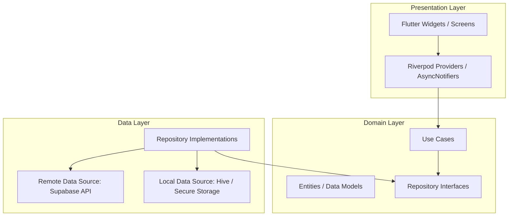
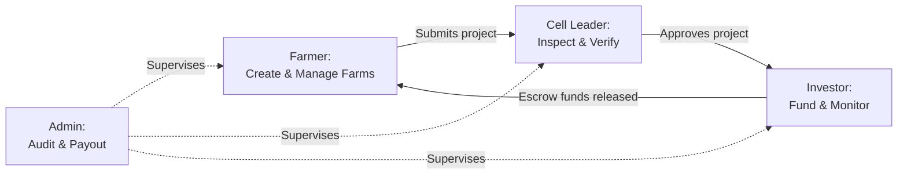
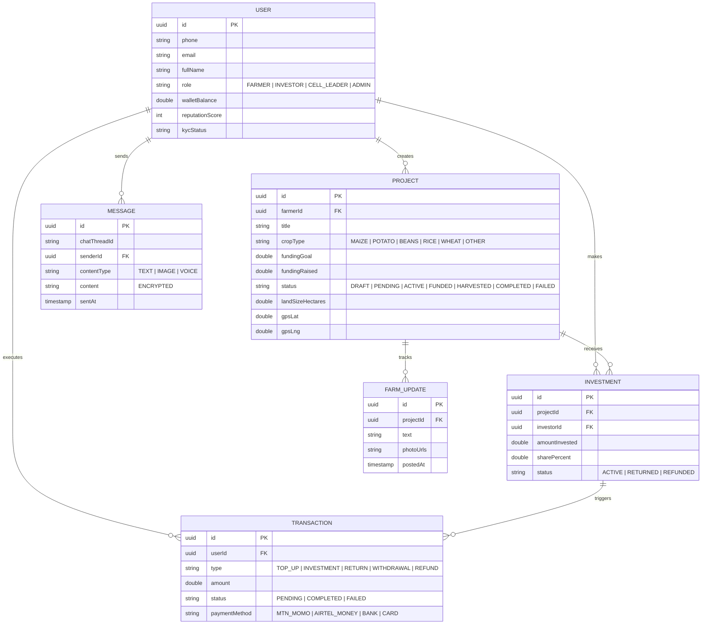

# 🌱 Umusaruro P2P — How the App Works
### A Complete Technical & Operational System Manual
---

## 📋 Executive Overview

**Umusaruro P2P** (meaning *“Harvest”* in Kinyarwanda) is a next-generation, peer-to-peer agricultural investment and farm management platform built with **Flutter**. It digitally bridges the gap between rural smallholder farmers who need working capital and urban or diaspora micro-investors who seek impact-driven financial returns.

Traditional agricultural finance in developing countries, particularly Rwanda, suffers from heavy friction: high collateral requirements, high-interest rates from traditional banks, opaque loan structures, and a lack of real-time monitoring. **Umusaruro P2P** solves this by:
1. **Replacing Collateral with Social Proof:** Using a decentralized trust layer verified by local cell leaders.
2. **Replacing Opaque Agreements with Digital Escrow:** Securing peer-to-peer micro-investments in milestone-based smart ledgers.
3. **Providing Real-Time Traceability:** Enabling farmers to log soil reports, GPS boundaries, weekly activity logs, and yield weight, which are synced directly to their investors' dashboards.

---

## 🏗️ System Architecture & Tech Stack

The application is engineered with a **Clean Architecture** design pattern and a **Feature-First** structure, promoting modularity, separation of concerns, and testability.



### 🛠️ Technical Stack Breakdown

| Architectural Layer | Technologies Used | Description |
|---|---|---|
| **Core Framework** | **Flutter 3.x (Dart 3)** | Cross-platform framework supporting native execution on Android and iOS. |
| **State Management** | **Flutter Riverpod (v3)** | A highly robust, compile-safe reactive caching and state-management system. |
| **Navigation** | **GoRouter** | Declarative router supporting deep linking, sub-routes, and role-based redirects. |
| **Local Storage (Offline)** | **Hive & Sqflite** | NoSQL and SQL local caching for structured offline-first sync. |
| **Secure Storage** | **Flutter Secure Storage** | Accesses Keychain (iOS) and Keystore (Android) for encrypted PINs and session tokens. |
| **Backend & Database** | **Supabase** | Provides PostgreSQL database, Authentication, Realtime WebSocket sync, and Object Storage. |
| **Payment Integrations** | **Flutterwave API** | Integrates MTN Mobile Money (MoMo), Airtel Money, credit cards, and bank transfers. |
| **Maps & GPS Mapping** | **Flutter Map & LatLong2** | Lightweight open-source mapping for logging and showing exact farm locations. |
| **Push Notifications** | **Firebase Cloud Messaging** | Real-time push alerts for project updates, transactions, and chat messages. |

---

## 👥 System Roles & User Profiles

The system operates around **four distinct roles**, each with specialized permissions and screen flows.



### 1. The Farmer (Capital Seeker)
* **Who they are:** Smallholder or mid-scale agricultural producers who own or lease arable land.
* **Core Goal:** Secure quick, fair funding for seasonal input purchases (seeds, fertilizers, tools) and labor.
* **Key Capabilities:**
  * Complete extended farmer onboarding (district, sector, cell, farming experience, land size).
  * Build agricultural investment projects using a 5-step form wizard.
  * Register GPS coordinates of their land using an interactive map pin-drop.
  * Submit weekly text + photo updates showing progress of their crops.
  * Log final harvest yield weight and sales data to trigger investor returns.
  * Engage in real-time encrypted messaging with investors who fund them.

### 2. The Investor (Capital Provider)
* **Who they are:** Urban professionals, diaspora members, or ESG (Environmental, Social, Governance) funds looking for transparent financial returns coupled with positive social impact.
* **Core Goal:** Direct peer-to-peer investment into agricultural projects with visible progress tracking and verified trust layers.
* **Key Capabilities:**
  * Complete standard KYC onboarding (National ID / Passport upload).
  * Browse active, verified farming projects through a cards feed or interactive map view.
  * Perform fractional micro-investment directly into projects (escrowed until 100% funded).
  * Monitor real-time growth progress via the Investor Portfolio Dashboard.
  * View real-time weather analytics and AI crop health forecasts.
  * Securely message the funded farmer to build partnerships and request updates.
  * Withdraw returns seamlessly to registered MTN/Airtel Mobile Money or bank accounts.

### 3. The Cell Leader (The Trust Anchor)
* **Who they are:** Local elected government or administrative leaders in the rural cells of Rwanda.
* **Core Goal:** Verify the identity, farming track record, and land ownership of farmers within their jurisdiction to eliminate platform fraud.
* **Key Capabilities:**
  * Receive real-time push notifications when a farmer in their cell submits a project.
  * Conduct virtual or physical audits (checking land size, crop types, and uploaded certificates).
  * Execute three decisions: **Approve** (projects go live instantly), **Request More Info**, or **Reject** (with a mandatory written rationale).
  * Flag active projects as "Under Investigation" if fraud is reported post-approval, freezing further investor funding.

### 4. The Platform Admin (Governance & Compliance)
* **Who they are:** Operations team at Umusaruro P2P managing risk, payment audits, disputes, and regional data configurations.
* **Key Capabilities:**
  * Resolve investor-farmer disputes and review flagged profiles or messages.
  * Manually approve large withdrawals and payouts following harvest sales.
  * Appoint and manage Cell Leader verifier credentials.
  * Configure system transaction commissions (e.g., 5% platform commission on investor profits).

---

## 🔄 Core App Workflows & Features

### 🔐 1. Authentication & Secure Onboarding
* **Multi-lingual Welcome:** The app offers a seamless onboarding carousel explaining the platform in **Kinyarwanda** (default) and **English**.
* **Phone & OTP Sign-up:** Users register using their phone number, verified instantly via a 60-second SMS OTP.
* **Role Partitioning:** A post-OTP selection screen directs users to their dedicated dashboard based on their role selection (Farmer or Investor).
* **6-Digit Secure PIN:** To protect funds, users set a custom 6-digit transaction PIN, stored using AES-256 encryption via Flutter Secure Storage. All high-security operations (investments, withdrawals, profile modifications) require this PIN.

### 🚜 2. Farmer Project Creation (5-Step Wizard)
To ensure projects are investor-ready, the app forces a guided 5-step form:

```
[Step 1: Basics] ──> [Step 2: Location] ──> [Step 3: Finances] ──> [Step 4: Evidence] ──> [Step 5: Review]
• Project Name       • District/Sector/Cell   • Total Goal (RWF)    • Crop Photos (min 2)  • Complete summary
• Crop Type          • GPS Pin Map Drop      • Min/Max Invest      • Soil Reports         • T&C acceptance
• Seasonal Window    • Land size (Hectares)   • Expected Return %   • Land Deed Upload     • Submit to Cell Leader
```

### 🧐 3. Cell Leader Audit Flow
* Once submitted, the project changes to `PENDING_VERIFICATION` and is hidden from investors.
* The local Cell Leader receives a push notification and reviews the profile, location coordinates, soil reports, and land deeds.
* Once approved, the project goes live (`ACTIVE`) in the marketplace.

### 🛒 4. Investor Marketplace & The Investment Flow
* **Discovery Feed:** The marketplace displays cards of active projects with an interactive search bar, crop category filters, and progress bars.
* **Map View:** Investors can switch to a Google Maps tab displaying projects as crop icons pinned to their exact GPS coordinates across Rwanda.
* **Fractional Funding & Escrow:** Investors select a project, input their desired contribution (between the farmer's set min/max limit), enter their 6-digit PIN, and confirm. Funds are deposited into a secure project escrow account.
* **Deadline Logic:**
  * If a project is **100% funded** by the deadline, escrow is released to the farmer to purchase seeds and fertilizer.
  * If a project **fails to reach 100% funding** by the deadline, the app automatically refunds 100% of the capital back to the respective investors' wallets with zero deductions.

### 💬 5. Real-Time Encrypted P2P Messaging
* **Auto-Thread Creation:** The moment an investor successfully funds a project, a private, secure chat thread is spawned between that investor and the farmer.
* **Rich Messaging:** Supports real-time text, photos, and voice notes (under 60s) using Supabase WebSockets.
* **Context Preservation:** A fixed "Project Context Bar" is anchored at the top of the chat, keeping both parties aligned on which specific crop and season they are discussing.

### 💼 6. Financial Ledger & Wallet Operations
* **Double-Entry Wallet:** Every user possesses a personal digital wallet linked to a local SQLite database that syncs to Supabase.
* **Multi-Channel Deposits:** Investors top up their wallet using MTN Mobile Money, Airtel Money, credit cards, or bank transfer processed by Flutterwave.
* **Payout Distribution Engine:** Once a harvest is sold, the farmer inputs the yield weight and total revenue. Upon admin approval, the system auto-distributes returns based on the formula:
  $$\text{Investor Payout} = \left( \frac{\text{Investor Contribution}}{\text{Total Project Goal}} \times \text{Harvest Revenue} \right) - \text{Platform Fee}$$
* **Platform Fee Structure:** The system charges a configurable percentage (e.g., 5%) *only on the earned profit* (not the principal) of the investor, keeping the app highly attractive to micro-investors. Farmers are charged a base service fee on overall harvest revenue.

---

## 🚀 Advanced Technical Features

### 📶 1. Offline-First Strategy for Rural Realities
Since farmers often operate in remote areas with unstable 2G/3G networks, the app is engineered to be **offline-first**:
* **Local SQLite Caching:** All projects, wallet balances, transaction logs, and messages are stored locally in Hive and SQLite.
* **Non-Blocking Queue:** If a farmer posts a farm update or a message offline, the app queues the action. A subtle persistent top banner alerts the user: *"You are offline. Queued updates will sync automatically when connection returns."*
* **Automatic Synchronization:** A background connectivity listener immediately triggers a bulk-upload sync once stable network is detected, notifying the user: *"Back online. Synced 3 updates successfully!"*

### 🧠 2. AI-Powered Yield & Fraud Guard
The app is reinforced with a lightweight machine learning layer (combining Google ML Kit on-device and Supabase Cloud Edge Functions):
* **AI Yield Estimator:** When a farmer inputs location, crop type (e.g., Maize), and land size (e.g., 2.5 Hectares), the AI engine cross-references historical seasonal data and weather models to output a predicted yield range (e.g., *“Estimated Yield: 5.5 - 6.8 tonnes”*). This acts as a trust metric for investors.
* **Smart Fraud Guard:**
  * **Duplication Alert:** Flagged automatically if GPS coordinates overlap with any existing active project.
  * **Plausibility Audit:** Flags project submissions that promise unrealistic ROI (e.g., >40%) or final harvest weights that deviate by more than 3x from the AI yield estimator, routing them to admins for manual compliance reviews.

---

## 🗄️ Database Entity Schema



---

## 🗺️ GoRouter Screen & Route Map

Below are the operational screens accessible based on auth states and user roles, matching the declared routes in `app_router.dart`:

### 1. Pre-Authentication Route Flow
* `/` (`SplashScreen`) ➔ Initial boot and dependency checks.
* `/onboarding` (`OnboardingScreen`) ➔ Interactive intro slides in English/Kinyarwanda.
* `/login` (`LoginScreen`) ➔ Secure PIN/password entry.
* `/register` (`RegisterScreen`) ➔ Phone registration, national ID collection, and role picker.
* `/otp` (`OtpScreen`) ➔ SMS verification validation.
* `/farmer-profile-setup` (`FarmerProfileSetupScreen`) ➔ Geo-location and farm size declaration.
* `/pending-verification` (`PendingVerificationScreen`) ➔ Shown to farmers awaiting Cell Leader profile approval.

### 2. Farmer Dashboard Route Flow (Bottom Nav Bar)
* `/farmer/home` (`FarmerHomeScreen`) ➔ Overview of total capital raised, active projects count, and quick links.
* `/farmer/projects` (`MyProjectsScreen`) ➔ Filterable list of all farmer's seasonal projects.
* `/farmer/projects/:id` (`ProjectDetailScreen`) ➔ In-depth project view with milestones and active investors list.
* `/farmer/projects/:id/harvest` (`HarvestSubmitScreen`) ➔ Log final weight and income from harvest.
* `/farmer/create-project` (`CreateProjectScreen`) ➔ Guided project creation wizard.
* `/farmer/messages` (`MessagesScreen`) ➔ Scrollable inbox of all active investor threads.
* `/farmer/transactions` (`TransactionsScreen`) ➔ Cash ledger of capital received and payments made.
* `/farmer/profile` (`ProfileScreen`) ➔ Trust score, reputation badges, and language selector.

### 3. Investor Dashboard Route Flow (Bottom Nav Bar)
* `/investor/home` (`InvestorHomeScreen`) ➔ Summary of total portfolio value, active investments, and ROI trends.
* `/investor/browse` (`BrowseProjectsScreen`) ➔ Map-integrated project marketplace feed with crop/location search.
* `/investor/projects/:id` (`ProjectDetailScreen`) ➔ Full view of a project, crop logs, cell leader verification, and the "Invest Now" button.
* `/investor/projects/:id/invest` (`InvestFlowScreen`) ➔ Secured transaction screen with PIN confirmation.
* `/investor/portfolio` (`PortfolioScreen`) ➔ Visual overview of project growth logs and expected yield dates.
* `/investor/messages` (`MessagesScreen`) ➔ Scrollable inbox of active chat threads with funded farmers.
* `/investor/transactions` (`TransactionsScreen`) ➔ Deposit/withdrawal ledger with Flutterwave references.
* `/investor/profile` (`ProfileScreen`) ➔ Wallet setup, KYC status, and preferences.

### 4. Cell Leader Route Flow
* `/cell-leader/home` (`CellLeaderHomeScreen`) ➔ Dashboard listing pending projects needing verification in their cell.
* `/cell-leader/project-verify/:id` ➔ Map and land document validation panel with Approval actions.
